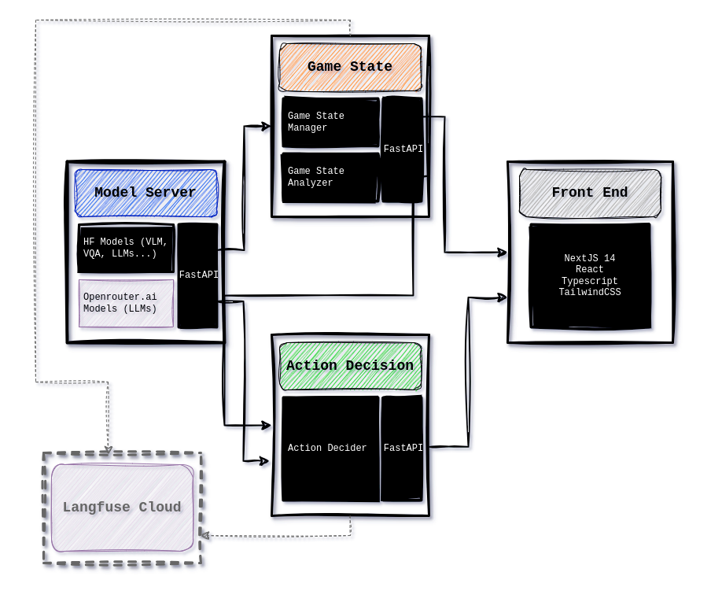

# LLM Carnival
Building a decision making agent via scene understanding with iteratively composed LLMs, and tree of thoughts strategy generation and evaluation. 

In this iteration, the use case is geared towards video games but the project has been inspired by robot planning and execution in physical, real-world scenarios.

## Overview

This project takes a microservices approach where each microservice is isolated in it's own docker container while providing FastAPI endpoints. 

* **Model Server** - hosts local Hugginface models and also connects to model APIs. Primarily making use of Openrouter.ai, emphasis on interoperability between different models.
* **Game State** - Uses a more capable LLM (Gemma 7B-it) to iteratively understand the scene with a quick and efficient VQA model (BLIP)
* **Action Decision** - The decision making engine powered via an LLM (Gemma 7B-it) to build Tree of Thoughts reasoning to determine the next step with self critique.
* **Frontend** - A simple front end built with NextJS/React to show status of interpreting game state and making a decision

### Tech Stack & Diagram

* LLMs
    * BLIP VQA (hosted locally via HF)
    * GPT2 (hosted locally via HF)
    * Gemma 2b-it (hosted locally via HF)
    * Gemma 7b-it (through Openrouter.ai)
    * Langfuse: observability and prompt engineering
* Docker / Poetry / Python
* FastAPI / httpx
* NextJS 14 / React / TS / TailwindCSS

Special shoutout to [Langfuse](https://langfuse.com/) and [Openrouter.ai](https://openrouter.ai/) for working with me to update their products so this project could happen.

## Install and Run
1. Clone and navigate to the respository
2. Run `docker-compose up --build`
3. Open a browser and head to `localhost:3000/dashboard` to begin

## Known Issues (work in progress)
* Use langfuse's new decorators (which this project helped inspire): https://github.com/orgs/langfuse/discussions/1009#discussioncomment-8682887
* Iteration on VQA model and prompts for more descriptive output
* Improved testing and error handling for APIs
* Add production flag for docker images and front end

## Preview in Action

#### Screenshot gets loaded into game state analyzer

#### Decision engine acts on summary of game state

